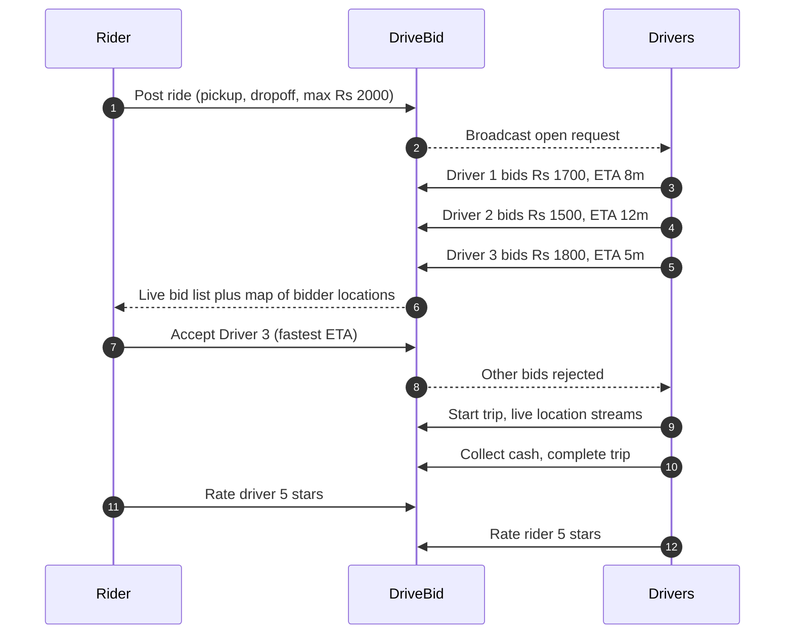
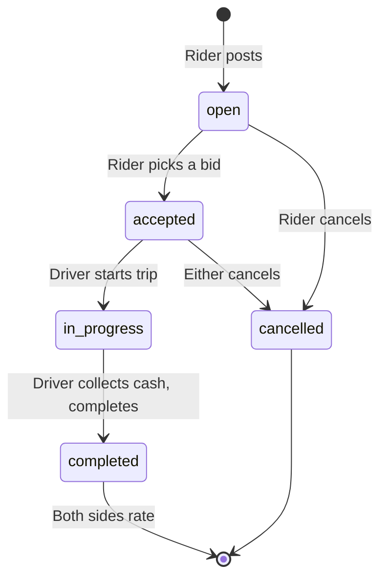
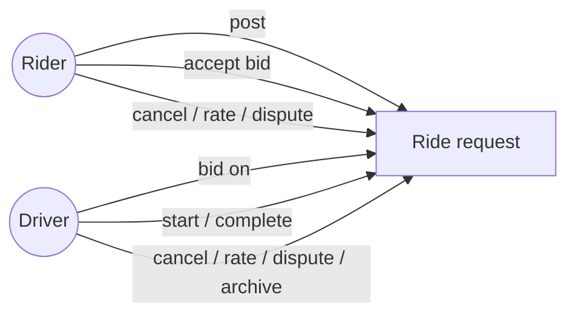

# DriveBid

Reverse-auction ride-hailing. Riders set a max budget, drivers bid for the trip, the rider picks the best offer. No surge, no mystery algorithm, no hidden fees.

Inspired by inDrive. Bidding is the default on day one, with more ideas (bundled trips, driver pools, scheduled pre-bids) still to come.

---

## Try it

| | |
|---|---|
| 🌐 Web | https://drivebid.vercel.app |
| 📱 Rider Android | [Download APK](https://github.com/atifali-pm/drivebid/releases/download/rider-android-latest/drivebid-rider-preview.apk) |
| 📱 Driver Android | [Download APK](https://github.com/atifali-pm/drivebid/releases/download/driver-android-latest/drivebid-driver-preview.apk) |

Sign up as a rider on one phone and a driver on another to see the full flow in real time.

> The free-tier backend sleeps when idle, so the first request after a quiet spell can take about 50 seconds to wake up. After that it's instant.

---

## What the rider gets

- Post a ride with a pickup, dropoff, and a max budget you control
- Budget wheel auto-snaps to estimated fare plus 5%, tunable in Rs 10 steps
- Drivers bid live. You see price, ETA, rating, trip count, and vehicle
- A small map shows each bidder's location before you accept, so proximity is part of the decision, not just price
- Cancel any time before the trip starts
- Rate the driver after the ride, and see the rating they gave you

## What the driver gets

- Open rides come with a big max-budget banner up top so you can triage fast
- Cards are collapsible. Tap to open the bid form, keep the feed tight otherwise
- Tap or scroll the wheel to pick a bid in Rs 10 steps. It defaults to the estimated fare
- One-tap Archive for rides you're skipping. Archived rides live on a dedicated screen (like WhatsApp's archived chats) with one-tap restore
- Clear trip flow: Accept, Navigate, Start, Collect cash, Complete
- Ratings go both ways, so reputation actually matters

## Real maps, no API keys

- Leaflet plus OpenStreetMap on web and both mobile apps
- Tap the map to place a pin exactly where you want
- OSRM for driving distance and duration, Photon for geocoding
- Rider sees the driver's live position during the trip
- No Google Maps or Mapbox keys. Nothing to rotate, nothing to pay for

## Vehicle types

Car 🚗, Motorcycle 🏍️, Rickshaw 🛺, Van 🚐. Each has its own fare model. The rider picks the type when posting, and drivers only see rides matching their vehicle. Pricing is a base fare plus a per-km rate (motorcycle cheapest, van priciest).

## In-ride chat

Once a bid is accepted, rider and driver can message each other in real time. WebSockets, persisted server-side, reachable from both dashboards and the trip-map screen.

## Cash-aware lifecycle

The driver confirms "collected Rs X cash" before marking a trip complete. Both sides see a "Paid / Collected" badge after. Platform commission (12%) is tracked. Payment rails come next.

## Safety: disputes and verification

Either side can file a dispute during or after a ride. Categories cover driver behavior, route issues, safety, payment, and so on. An admin console reviews and responds. Driver onboarding captures CNIC, license, and vehicle details. Role-based auth everywhere.

## Two-way ratings

Riders rate drivers, drivers rate riders. 5 stars, optional comment, locked once submitted.

## Phone auth (optional)

Email and password is the default. Firebase Phone Auth is wired as an alternative and falls back to a backend-issued OTP if Firebase isn't set up.

---

## How it works

### Rider flow

### Ride lifecycle

### Who can do what

---

## Screenshots

### Rider (mobile)

| Sign in | Post a ride | Live bids |
|---|---|---|
|  |  |  |

| Trip in progress | Rating |
|---|---|
|  |  |

### Driver (mobile)

| Dashboard | Bid form | Trip |
|---|---|---|
|  |  |  |

| Earnings |
|---|
|  |

### Web

Search by address, landmark, or sector. Click anywhere on the map for exact pin placement.

Drivers bid their own price and ETA. The rider sees all offers live and picks the best one.

Each open request shows a mini-map with the pickup to dropoff route, so drivers know what they're bidding on.

Once the rider accepts a bid, the trip moves through accepted, in progress, and completed.

Both sides rate each other. One rating per side, locked once submitted.

> Web screenshots are captured reproducibly by [`frontend/scripts/screenshots.mjs`](frontend/scripts/screenshots.mjs). It drives headless Chrome through real flows with API-seeded state.

---

## Roadmap

### Shipped

- Web prototype with bidding, lifecycle, real maps, and two-way ratings
- Live WebSocket updates for bids, driver location, and in-ride chat
- Android apps for rider and driver, native Expo, open to the public
- Public distribution: web on Vercel, APKs on GitHub Releases, backend on Render
- Pre-accept bidder map
- Cash-aware trip lifecycle with disputes and vehicle types
- WhatsApp-style archived rides for drivers

### Next up

- Real payment rails (JazzCash, Easypaisa, Stripe)
- Play Store submission (signed release APKs, data safety form)
- iOS apps (same Expo codebase, App Store build plus TestFlight)

### On the idea board

- Reverse auction with time decay. Drivers bid down over 60 seconds for urgency
- Driver pools. Carpool bundling, multiple riders share a single winning bid
- Scheduled rides. Pre-bid tomorrow morning the night before, solving commute surge
- Composite services. Parcel, freight, and tasks under the same bid engine
- Trust score. Composite reputation beyond stars
- Offline-first driver app. SMS fallback for poor-signal areas
