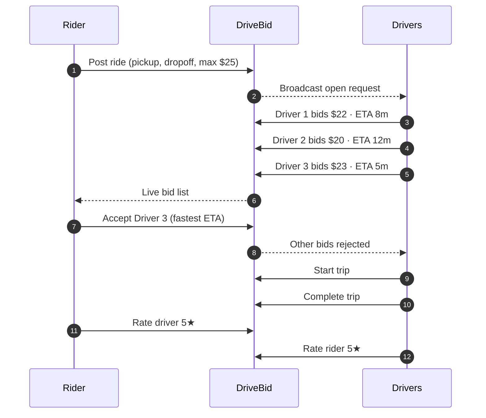
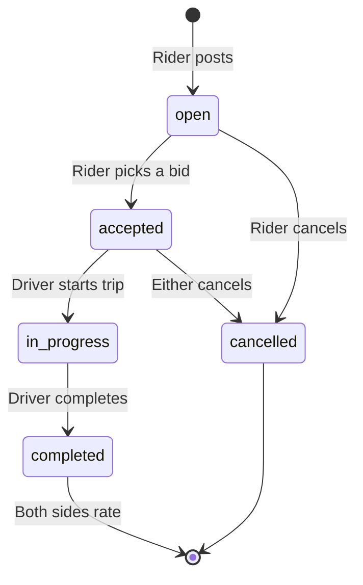
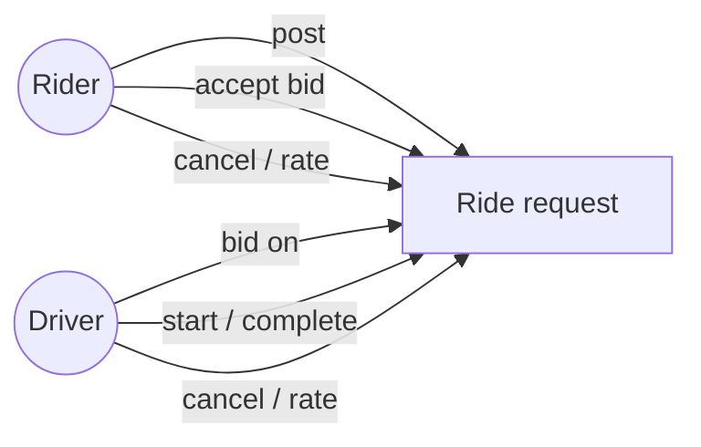
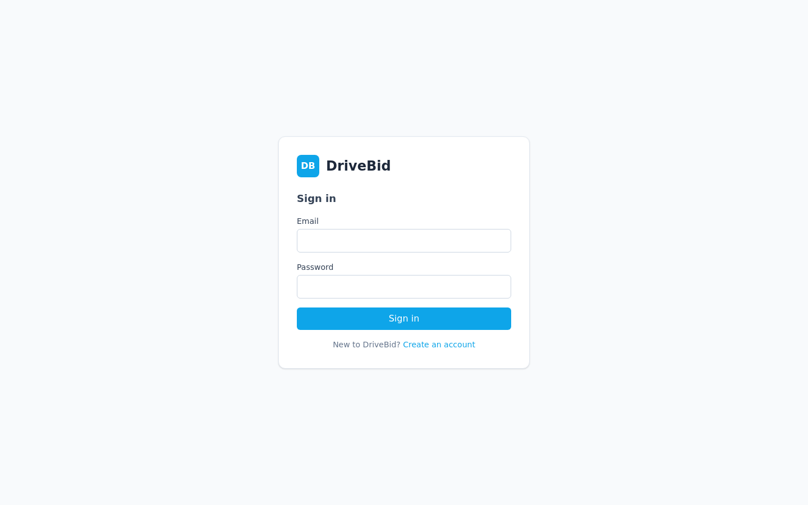
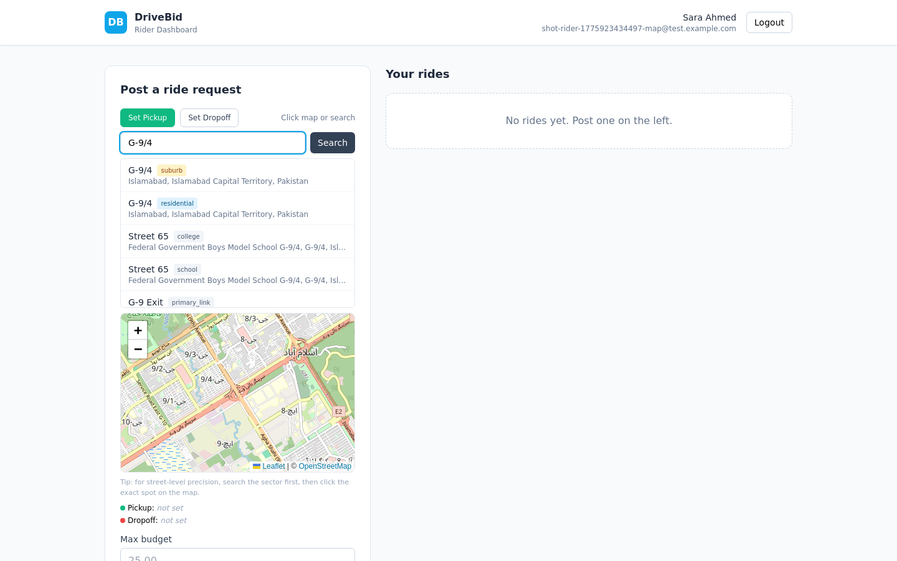
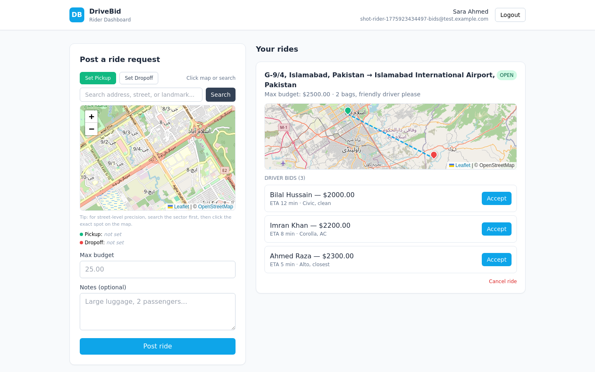
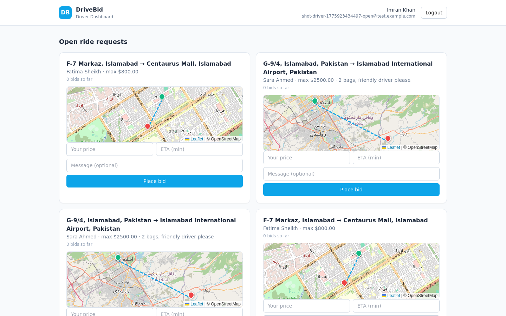
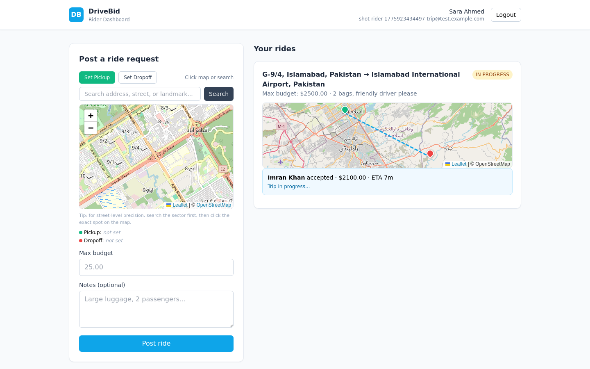
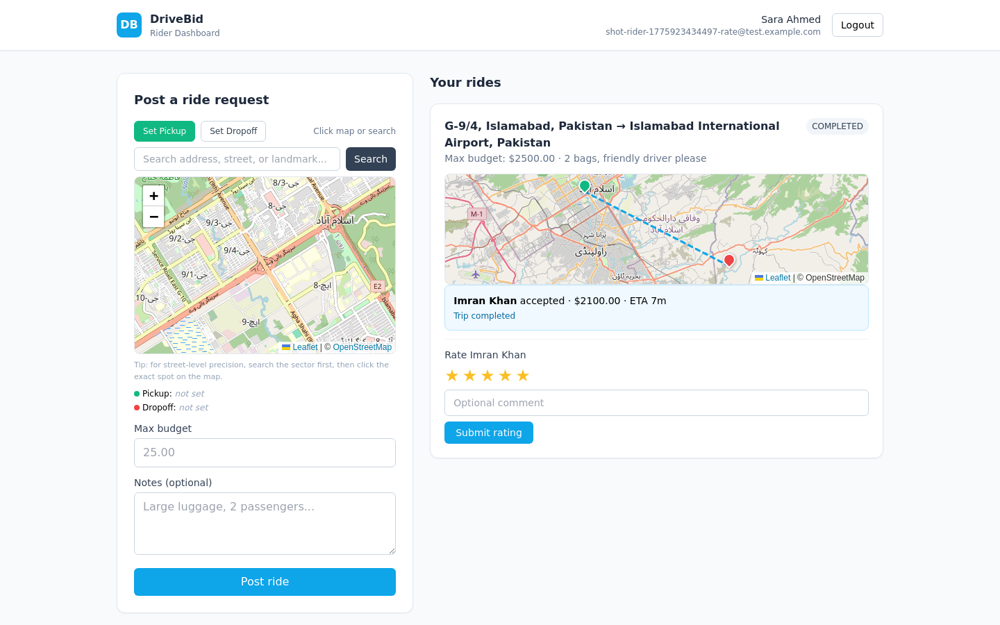

# DriveBid

**Reverse-auction ride-hailing.** Riders set their max budget, drivers bid for the trip, the rider picks the best offer. No surge pricing, no opaque algorithms, no hidden fees.

Inspired by inDrive, but built around a transparent bidding model from day one — with fresh ideas like bundled trips, driver pools, and scheduled pre-bids on the roadmap.

---

## Key features

### Rider — name your price

- Post a ride with pickup, dropoff, and your **max budget**
- Watch drivers bid in real time — see price, ETA, and driver info
- Pick the best offer on *your* terms, not an algorithm's
- Cancel any time before the trip starts
- Rate the driver after the trip — and see the rating they gave you

### Driver — bid, don't wait

- See open ride requests in your area
- Place your own bid — price and ETA are yours to set
- No forced surge, no opaque platform fees
- Clear trip lifecycle: Accept → Start → Complete
- Two-way ratings build your reputation over time

### Accurate map picking

- Search by address, landmark, or sector name (e.g. *"G-9/4 Islamabad"*)
- Click anywhere on the map for **exact** pin placement
- Type-badged results — tell a sector from a street from a building at a glance
- Location-biased search prefers places near your current view
- Mini-map preview on every ride card showing pickup → dropoff route
- Powered by OpenStreetMap + Photon geocoder — **zero API keys**

### Two-way ratings

- Riders rate drivers, drivers rate riders — accountability both directions
- 5-star system with optional written comments
- One rating per side, locked once submitted

### Role-based auth

- Separate rider and driver accounts, one click apart at signup
- JWT sessions, bcrypt-hashed passwords
- Every endpoint guarded — a rider can't start a trip, a driver can't post a ride request

---

## How it works

### Rider flow



### Ride lifecycle



### Who can do what



---

## Screenshots

### Login



### Rider — picking pickup & dropoff on the map

Search by address, landmark, or sector. Results come back with type badges (suburb / residential / street / building) so you can pick the right granularity. Click anywhere on the map for exact pin placement.



### Rider — live driver bids

Drivers bid their own price and ETA. The rider sees all offers live and picks the best one.



### Driver — browsing open rides

Each open request shows a mini-map with the pickup → dropoff route, so drivers know what they're bidding on.



### Trip in progress

Once the rider accepts a bid, the driver moves the ride through the lifecycle: accepted → in progress → completed.



### Post-trip rating

Both sides rate each other. One rating per side, locked once submitted.



> Screenshots are captured reproducibly by [`frontend/scripts/screenshots.mjs`](frontend/scripts/screenshots.mjs) — it drives headless Chrome through real flows with API-seeded state.

---

## Roadmap

- [x] **Phase 1** — Web prototype: bidding, lifecycle, maps, ratings
- [ ] **Phase 2** — Live WebSocket updates (replace 4s polling)
- [ ] **Phase 3** — Android app (React Native, shares API client with web)
- [ ] **Phase 4** — iOS app
- [ ] **Reverse auction with time decay** — drivers bid *down* over 60s for urgency
- [ ] **Driver pools** — carpool bundling, multiple riders share a single winning bid
- [ ] **Scheduled rides** — pre-bid tomorrow morning the night before (solves commute surge)
- [ ] **Composite services** — parcel, freight, and tasks under the same bid engine
- [ ] **Trust score** — composite reputation (not just stars)
- [ ] **Offline-first driver app** — SMS fallback for poor-signal areas

---

## Tech stack

<details>
<summary>Click to expand</summary>

| Layer | Choice |
|---|---|
| Backend | FastAPI + SQLAlchemy |
| Database | SQLite (swappable to PostgreSQL via one env var) |
| Frontend | React 18 + TypeScript + Vite + Tailwind CSS |
| Maps | Leaflet + react-leaflet |
| Tiles | OpenStreetMap — free, no key |
| Geocoding | Photon (komoot) — free, no key |
| Auth | JWT bearer tokens + bcrypt |

No paid services, no API keys, no vendor lock-in.

</details>

## Running locally

<details>
<summary>Click to expand</summary>

### 1. Map `drivebid.local` to localhost

```bash
echo "127.0.0.1 drivebid.local" | sudo tee -a /etc/hosts
```

### 2. Backend (port 8050)

```bash
cd backend
python3 -m venv .venv && source .venv/bin/activate
pip install -r requirements.txt
uvicorn app.main:app --port 8050 --host 127.0.0.1
```

API docs at http://drivebid.local:8050/docs

### 3. Frontend (port 5173)

```bash
cd frontend
npm install
npm run dev -- --host drivebid.local --port 5173
```

Open http://drivebid.local:5173 and register one rider + one driver (try in two browser windows) to test the full flow end-to-end.

</details>

## License

Unlicensed prototype — not for production use.
