# DriveBid

**Reverse-auction ride-hailing.** Riders set their max budget, drivers bid for the trip, the rider picks the best offer. No surge pricing, no opaque algorithms, no hidden fees.

Inspired by inDrive, but built around a transparent bidding model from day one — with fresh ideas like bundled trips, driver pools, and scheduled pre-bids on the roadmap.

---

## Try it now

| | |
|---|---|
| 🌐 Web | https://drivebid.vercel.app |
| 📱 Rider Android | [Download APK](https://github.com/atifali-pm/drivebid/releases/download/rider-android-latest/drivebid-rider-preview.apk) |
| 📱 Driver Android | [Download APK](https://github.com/atifali-pm/drivebid/releases/download/driver-android-latest/drivebid-driver-preview.apk) |

Sign up as a rider on one device and a driver on another to see the full bid flow in real time.

> Free-tier backend sleeps when idle — the first request after a quiet spell can take ~50 seconds to wake up. It's fine once warm.

---

## Key features

### Rider — name your price

- Post a ride with pickup, dropoff, and your **max budget**
- Budget wheel auto-snaps to *estimated fare + 5%*, tunable in Rs 10 steps
- Watch drivers bid in real time — see price, ETA, driver rating, trip count, vehicle
- **See each bidder on a live map** before accepting — judge proximity, not just price
- Cancel any time before the trip starts
- Rate the driver after the trip — and see the rating they gave you

### Driver — bid, don't wait

- See open ride requests with a **prominent max-budget banner** so you can triage instantly
- Cards are **collapsible** — tap to expand the bid form, keep the feed tight otherwise
- Tap or swipe the wheel to pick a bid price in Rs 10 steps (default snaps to estimated fare)
- One-tap **Archive** for rides you're not interested in — archived rides live on a dedicated WhatsApp-style screen with one-tap restore
- Clear trip lifecycle: Accept → Navigate → Start → Collect cash → Complete
- Two-way ratings build your reputation over time

### Real maps, no API keys

- Interactive Leaflet + OpenStreetMap tiles on web *and* both mobile apps
- Tap anywhere on the map for exact pin placement
- OSRM-routed distance + duration, Photon-geocoded addresses and sectors
- Live driver location shown to the rider during the trip
- **Zero Google Maps / Mapbox keys** — nothing to rotate, nothing to pay for

### Vehicle types

- Car 🚗, Motorcycle 🏍️, Rickshaw 🛺, Van 🚐 — each with its own fare model
- Rider picks the vehicle type at post time; drivers see their matching requests
- Pricing engine: `base + per-km × km` with different rates per vehicle (motorcycle cheapest, van premium)

### In-ride chat

- WebSocket-backed real-time messaging between rider and driver once a bid is accepted
- Accessible from both dashboards and the trip-map screen
- Message history persists server-side

### Cash-aware trip lifecycle

- Driver confirms *"Rs X cash collected"* before marking a trip complete
- Both sides see a "✓ Paid / Collected" badge on completed trips
- Platform commission (12%) is tracked — payment-rail integration is roadmap

### Safety — disputes & verification

- Either side can file a **dispute** during or after a trip (driver behavior, route issue, safety, payment, etc.)
- Admin console reviews and responds
- Driver onboarding captures CNIC, license, vehicle plate/model/color for verification
- Separate rider and driver accounts; JWT sessions; bcrypt-hashed passwords; every endpoint guarded by role

### Two-way ratings

- Riders rate drivers, drivers rate riders — accountability both directions
- 5-star with optional comments
- One rating per side, locked once submitted

### Phone-auth optional

- Email/password signup is the default
- Firebase Phone Auth is wired as an optional login path — falls back to backend-issued OTP if Firebase isn't configured

---

## How it works

### Rider flow

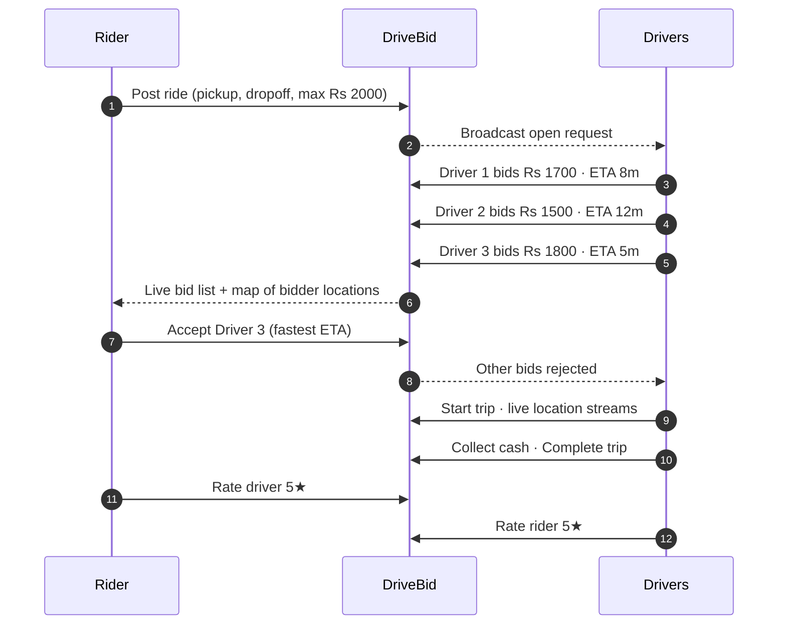

### Ride lifecycle

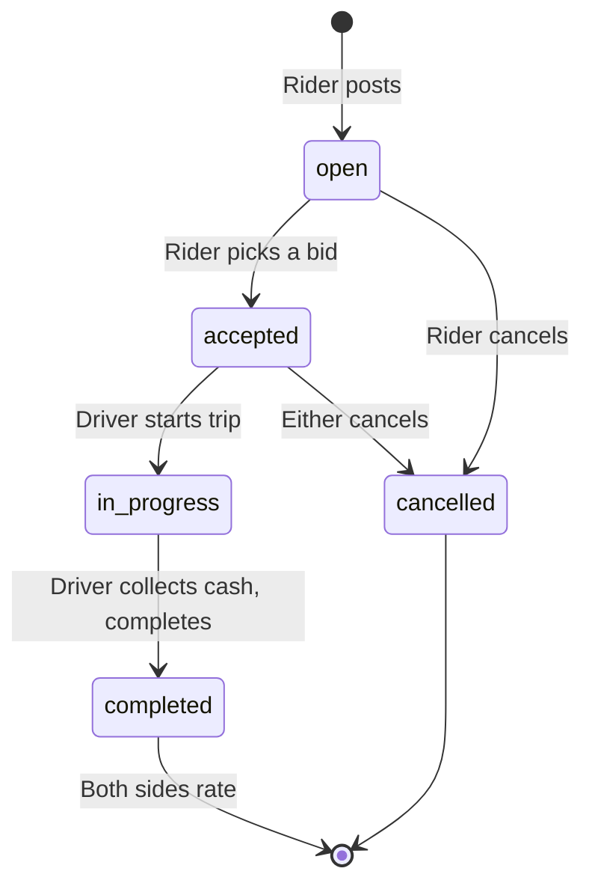

### Who can do what

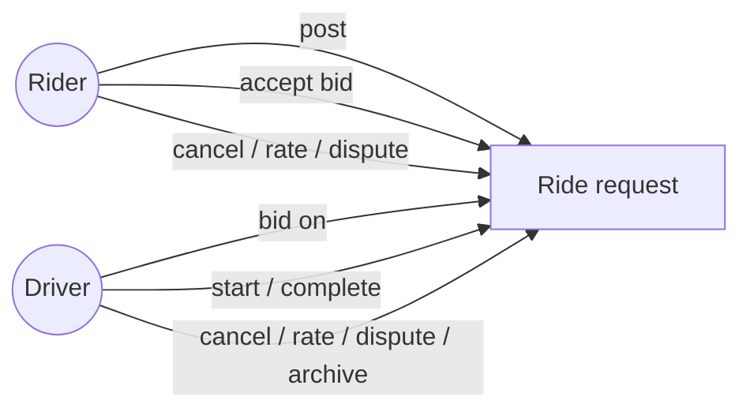

---

## Screenshots

### Rider (mobile)

| Sign in | Post a ride | Live bids |
|---|---|---|
| 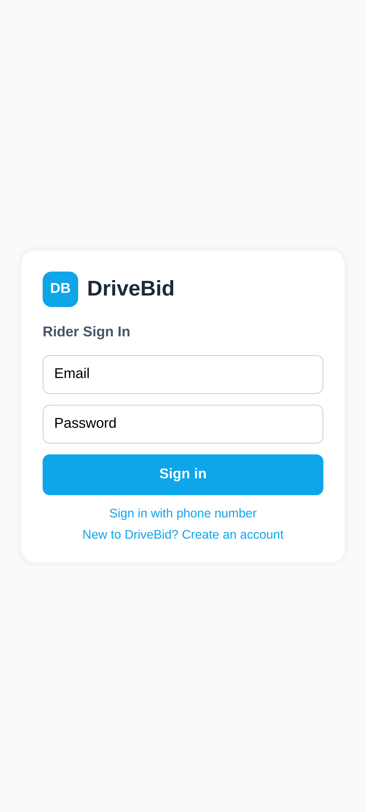 | 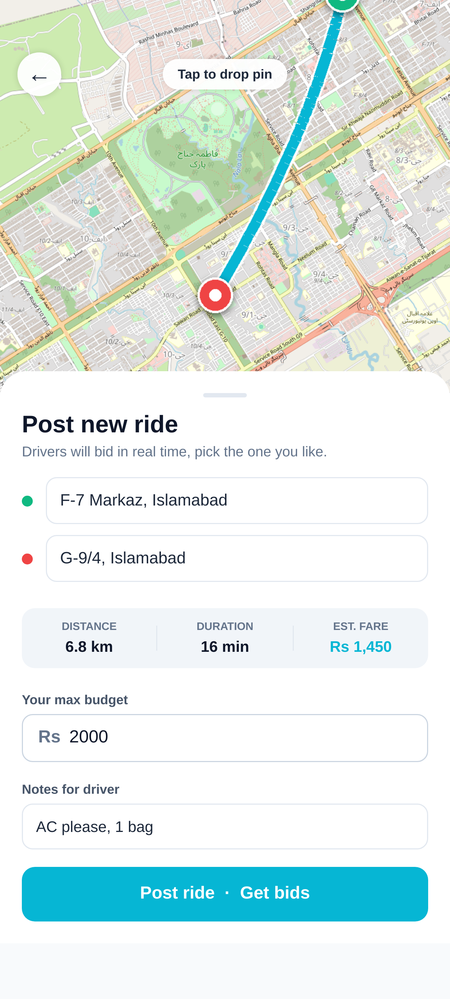 | 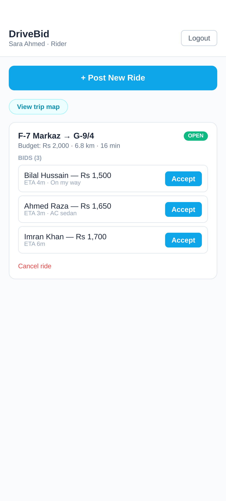 |

| Trip in progress | Rating |
|---|---|
| 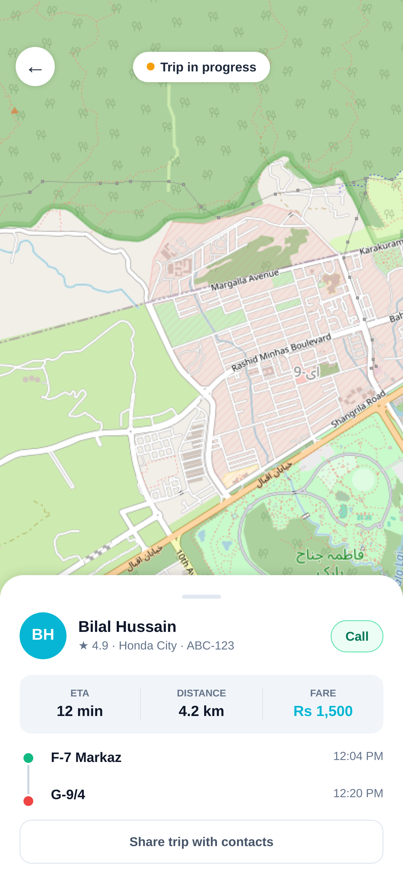 | 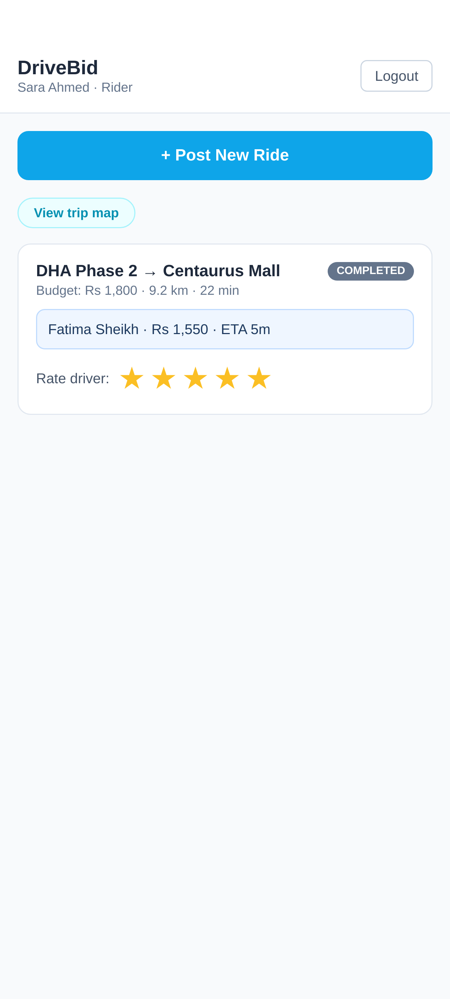 |

### Driver (mobile)

| Dashboard | Bid form | Trip |
|---|---|---|
| 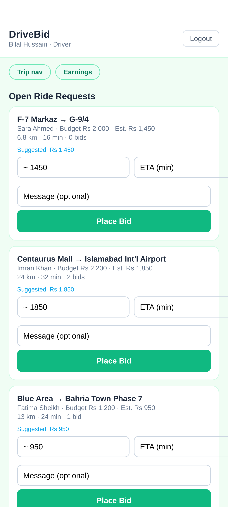 | 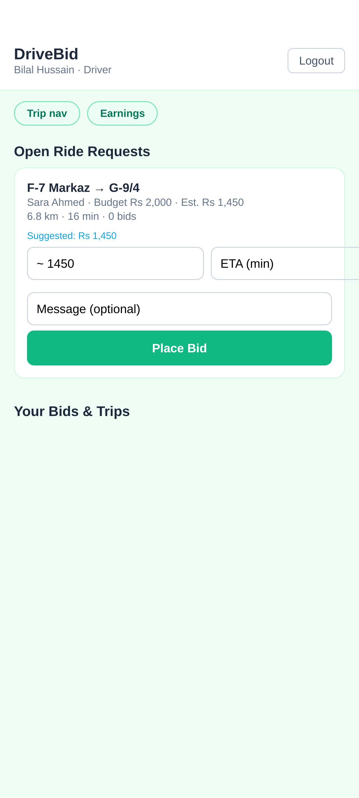 | 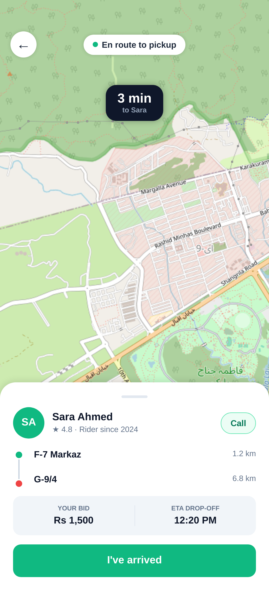 |

| Earnings |
|---|
| 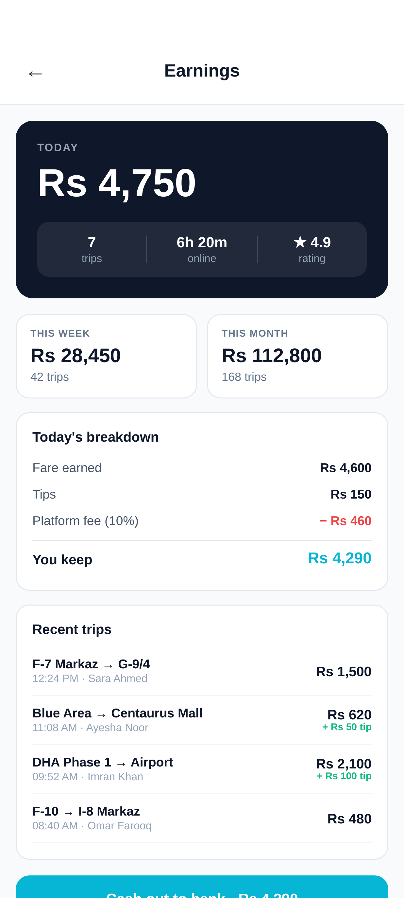 |

### Web


Search by address, landmark, or sector. Click anywhere on the map for exact pin placement.


Drivers bid their own price and ETA. The rider sees all offers live and picks the best one.


Each open request shows a mini-map with the pickup → dropoff route, so drivers know what they're bidding on.


Once the rider accepts a bid, the trip moves through accepted → in progress → completed.


Both sides rate each other. One rating per side, locked once submitted.


> Web screenshots are captured reproducibly by [`frontend/scripts/screenshots.mjs`](frontend/scripts/screenshots.mjs) — it drives headless Chrome through real flows with API-seeded state.

---

## Roadmap

- [x] **Phase 1** — Web prototype: bidding, lifecycle, maps, ratings
- [x] **Phase 2** — Live WebSocket updates (bids, driver location, chat)
- [x] **Phase 3** — Android apps (rider + driver, native Expo)
- [x] **Phase 4** — Public web + Android APK distribution (Render + Vercel + GitHub Releases)
- [ ] **Phase 5** — Real payment rails (JazzCash / Easypaisa / Stripe)
- [ ] **Phase 6** — iOS apps
- [ ] **Reverse auction with time decay** — drivers bid *down* over 60s for urgency
- [ ] **Driver pools** — carpool bundling, multiple riders share a single winning bid
- [ ] **Scheduled rides** — pre-bid tomorrow morning the night before (solves commute surge)
- [ ] **Composite services** — parcel, freight, and tasks under the same bid engine
- [ ] **Trust score** — composite reputation (not just stars)
- [ ] **Offline-first driver app** — SMS fallback for poor-signal areas
- [ ] **Play Store submission** — signed release APKs + data safety form

---

## Running locally

<details>
<summary>Click to expand</summary>

### 1. Map `drivebid.local` to localhost

```bash
echo "127.0.0.1 drivebid.local" | sudo tee -a /etc/hosts
```

### 2. Backend (port 8050)

```bash
cd backend
python3 -m venv .venv && source .venv/bin/activate
pip install -r requirements.txt
uvicorn app.main:app --port 8050 --host 127.0.0.1
```

API docs at http://drivebid.local:8050/docs

### 3. Web frontend (port 5173)

```bash
cd frontend
npm install
npm run dev -- --host drivebid.local --port 5173
```

Open http://drivebid.local:5173 and register one rider + one driver (try in two browser windows) to test the full flow end-to-end.

### 4. Mobile apps (Expo Go)

```bash
# Rider
cd mobile/rider
npm install --legacy-peer-deps
npx expo start --lan --port 8082

# Driver (in another terminal)
cd mobile/driver
npm install --legacy-peer-deps
npx expo start --lan --port 8083
```

Scan the QR codes in Expo Go. The apps auto-detect your laptop's LAN IP and hit the local backend at `:8050`.

</details>

## License

Unlicensed prototype — not for production use.
